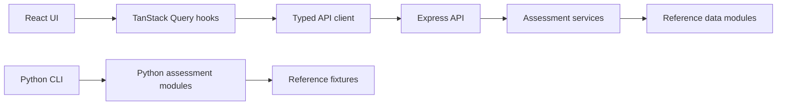
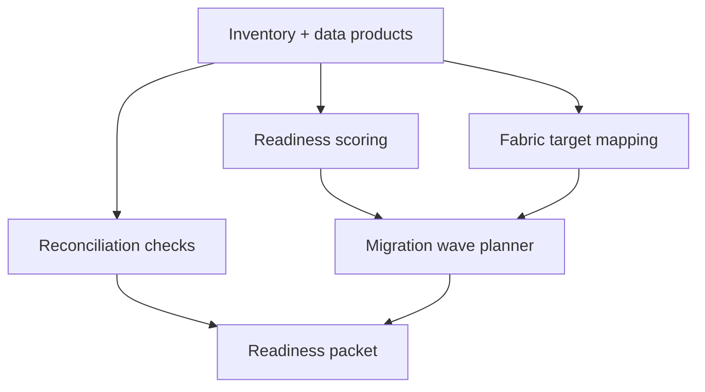

# FabricShift

FabricShift is a Synapse-to-Microsoft Fabric migration readiness workbench for assessing legacy analytics estates, mapping assets to Fabric targets, planning migration waves, and exporting executive readiness packets.

The application ships with a realistic reference dataset so the full workflow can be run immediately without external cloud credentials.

## Features

- Portfolio dashboard with inventory, readiness, risk, cost, and wave metrics
- Business domain registry with ownership, criticality, asset counts, and readiness bands
- Inventory explorer for workspaces, pipelines, SQL objects, and Power BI reports
- Data product catalog with contracts, profile metrics, quality findings, and readiness gauges
- Fabric target mapping for pipeline, SQL, report, and semantic model assets
- Readiness scoring with blockers, evidence, effort bands, and recommended remediation
- Reconciliation checks for row count, key uniqueness, null rate, balance, freshness, and category distribution
- Interactive lineage view with asset impact analysis
- Migration wave planner with prerequisites, risk notes, and effort sequencing
- Report packet export as Markdown and JSON
- Standalone Python CLI for terminal-based assessment and export workflows

## Tech Stack

- TypeScript monorepo with pnpm workspaces
- React 19, Vite, Wouter, TanStack Query
- Tailwind CSS 4 with Radix UI primitives
- Node.js, Express 5, Pino logging
- Python CLI package with dataclass models
- In-memory reference data for a complete local demo

## Project Structure

```text
.
├── artifacts/
│   ├── api-server/          # Express API
│   └── fabricshift-ui/      # React/Vite application
├── fabricshift/             # Optional Python CLI package
├── lib/
│   └── api-client-react/    # Typed React API client
├── package.json             # Root workspace commands
├── pnpm-workspace.yaml      # Workspace and dependency catalog
└── tsconfig.base.json       # Shared TypeScript settings
```

## Architecture





## Requirements

- Node.js 24 or newer
- pnpm 10 or newer
- Python 3.10 or newer for the optional CLI

## Environment

The app runs without required secrets.

Optional environment variables:

| Variable | Default | Used by | Description |
|---|---:|---|---|
| `PORT` | API `8080`, UI `25655` | API/UI | Server port |
| `BASE_PATH` | `/` | UI | Base path for hosted deployments |
| `API_PROXY_TARGET` | `http://localhost:8080` | UI dev server | Backend target for local `/api` proxy |
| `NODE_ENV` | `development` | API/UI | Runtime mode |

## Install

```bash
pnpm install
```

## Run

Start the API:

```bash
pnpm --filter @workspace/api-server run dev
```

Start the UI in another terminal:

```bash
pnpm --filter @workspace/fabricshift-ui run dev
```

Open:

```text
http://localhost:25655/
```

## Demo Walkthrough

1. Open the Dashboard to review estate-level readiness, cost, and blocker metrics.
2. Visit Inventory to inspect workspaces, pipelines, SQL objects, and reports.
3. Open Data Products and drill into a product contract and profile.
4. Run Fabric Mapping from the Mapping page.
5. Run Readiness Assessment and review blockers and evidence.
6. Run Reconciliation and expand failed checks.
7. Open Lineage, select an asset, and run impact analysis.
8. Plan Migration Waves and review prerequisites.
9. Generate a migration readiness packet from Reports.

## API Reference

All API routes are prefixed with `/api`.

| Method | Endpoint | Purpose |
|---|---|---|
| `GET` | `/api/healthz` | Health check |
| `GET` | `/api/config` | App configuration |
| `GET` | `/api/inventory/summary` | Estate summary |
| `GET` | `/api/inventory/domains` | Business domains |
| `GET` | `/api/inventory/workspaces` | Workspace inventory |
| `GET` | `/api/inventory/pipelines` | Pipeline inventory |
| `GET` | `/api/inventory/sql-objects` | SQL object inventory |
| `GET` | `/api/inventory/reports` | Report inventory |
| `GET` | `/api/data-products` | Data product catalog |
| `GET` | `/api/data-products/:id` | Product detail |
| `GET` | `/api/data-products/:id/contract` | Product contract |
| `GET` | `/api/data-products/:id/profile` | Product profile |
| `POST` | `/api/mapping/fabric-targets` | Run target mapping |
| `GET` | `/api/mapping/results` | Mapping results |
| `POST` | `/api/readiness/assess` | Run readiness scoring |
| `GET` | `/api/readiness/results` | Readiness results |
| `POST` | `/api/reconciliation/run` | Run reconciliation |
| `GET` | `/api/reconciliation/results` | Reconciliation results |
| `GET` | `/api/lineage/graph` | Lineage graph |
| `GET` | `/api/lineage/asset/:id` | Asset lineage detail |
| `POST` | `/api/lineage/impact` | Impact analysis |
| `POST` | `/api/migration-waves/plan` | Create wave plan |
| `GET` | `/api/migration-waves` | Migration waves |
| `POST` | `/api/reports/migration-readiness` | Create readiness packet |
| `GET` | `/api/reports/:id/markdown` | Markdown export |
| `GET` | `/api/reports/:id/json` | JSON export |

## Validation

```bash
pnpm run typecheck
pnpm run build
python3 -m compileall -q fabricshift/fabricshift
```

API smoke check:

```bash
curl http://localhost:8080/api/healthz
```

Expected response:

```json
{"status":"ok"}
```

## Python CLI

```bash
cd fabricshift
pip install -e .
fabricshift assess
fabricshift waves --max-waves 4
fabricshift export --output assessment.json
```

## Deployment Notes

Build both applications with:

```bash
pnpm run build
```

The API build output is written to `artifacts/api-server/dist`. The UI build output is written to `artifacts/fabricshift-ui/dist/public`.
